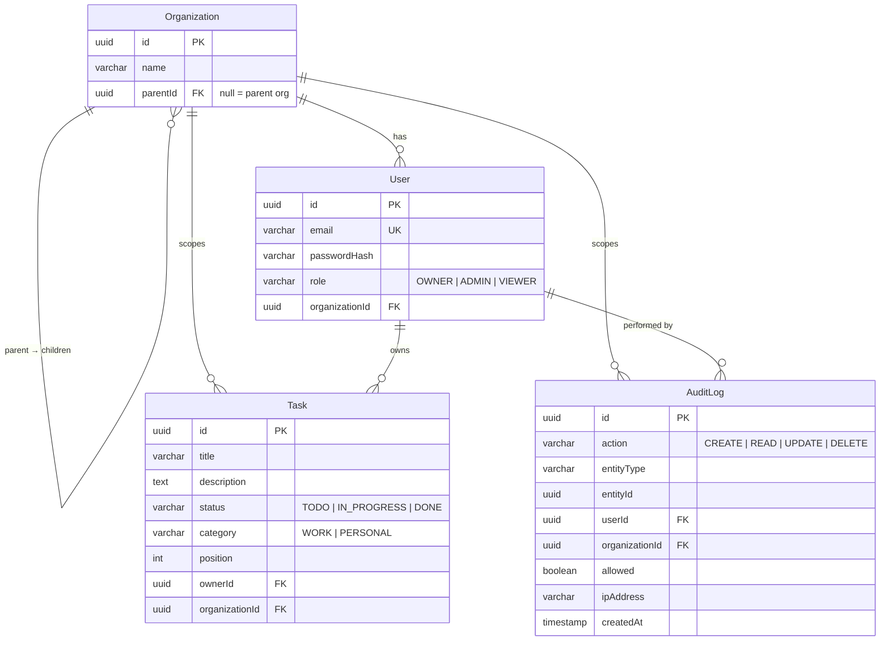

# TurboVets Fullstack

NX monorepo with a NestJS API, Angular dashboard, and shared auth library. Multi-tenant task management with role-based access control, org-scoped data, and audit logging.

## Tech Stack

| Layer | Technology |
|-------|-----------|
| Monorepo | NX 22 |
| API | NestJS 11, TypeORM 0.3, Passport JWT |
| Database | SQLite (better-sqlite3) |
| Frontend | Angular 21, Tailwind CSS 4, Angular CDK |
| Auth | JWT (bcrypt passwords, role-based guards) |
| CI | GitHub Actions |
| Containers | Docker + docker-compose |

## Quick Start

```bash
# Install
npm install

# Seed the database
npx ts-node -r ./api/src/database/seed-bootstrap.js ./api/src/database/seed.ts

# Start API (port 3000)
npx nx serve api

# Start dashboard (port 4200) — in a second terminal
npx nx serve dashboard
```

Open `http://localhost:4200` and log in with a seed user.

### Docker

```bash
docker-compose up --build
```

Dashboard at `http://localhost:4200`, API at `http://localhost:3000/api`.

## Environment Variables

Create a `.env` file in the project root:

```
JWT_SECRET=dev-secret-key
JWT_EXPIRES_IN=1d
DATABASE_NAME=taskdb.sqlite
```

| Variable | Description | Default |
|----------|-------------|---------|
| `JWT_SECRET` | Secret for signing JWTs | *(required)* |
| `JWT_EXPIRES_IN` | Token expiry (`1d`, `2h`, `30m`) | `1d` |
| `DATABASE_NAME` | SQLite file path | `taskdb.sqlite` |
| `PORT` | API listen port | `3000` |

## Architecture

```
turbovets-fullstack/
├── api/                  # NestJS backend
│   └── src/
│       ├── auth/         # JWT strategy, guards, login
│       ├── tasks/        # CRUD controller + service
│       ├── audit/        # Interceptor + audit log
│       ├── database/     # TypeORM + SQLite config, seed
│       └── entities/     # Organization, User, Task, AuditLog
├── dashboard/            # Angular frontend
│   └── src/app/
│       ├── auth/         # AuthService, guard, interceptor
│       ├── login/        # Login page
│       └── dashboard/    # Task list, filters, CRUD modal, drag-drop
├── auth/                 # Shared library (@turbovets-fullstack/auth)
│   └── src/lib/
│       ├── enums/        # Role enum
│       ├── guards/       # RolesGuard
│       ├── decorators/   # @Roles()
│       ├── helpers/      # resolveOrgScope, canAccessOrg
│       └── interfaces/   # RequestUser
└── docker-compose.yml
```

## ERD



## RBAC Matrix

| Action | OWNER | ADMIN | VIEWER |
|--------|:-----:|:-----:|:------:|
| `GET /api/tasks` | yes | yes | yes |
| `POST /api/tasks` | yes | yes | no (403) |
| `PUT /api/tasks/:id` | yes | yes | no (403) |
| `DELETE /api/tasks/:id` | yes | yes | no (403) |
| `GET /api/audit-log` | yes | yes | no (403) |
| Access child org data | yes | no | no |

All endpoints return **401** without a valid JWT.

### Org Hierarchy Rules

Organizations form a single-level parent/child tree:

```
Acme Corp (parent, parentId = null)
├── Acme East (child, parentId = Acme Corp)
└── Acme West (child, parentId = Acme Corp)
```

| User location | Role | Can see |
|--------------|------|---------|
| Parent org | OWNER | Own org + all child orgs |
| Parent org | ADMIN | Own org only |
| Parent org | VIEWER | Own org only |
| Child org | any | Own org only (no upward access) |

## API Endpoints

Base URL: `http://localhost:3000/api`

### Auth

```bash
# Login
curl -X POST http://localhost:3000/api/auth/login \
  -H "Content-Type: application/json" \
  -d '{"email":"owner@acme.com","password":"password123"}'
# → {"accessToken":"eyJhbG..."}

# Get current user
curl http://localhost:3000/api/auth/me \
  -H "Authorization: Bearer <token>"
# → {"userId":"...","role":"OWNER","orgId":"..."}
```

### Tasks

```bash
# List tasks (with optional filters)
curl http://localhost:3000/api/tasks?status=TODO&category=WORK \
  -H "Authorization: Bearer <token>"

# Create task
curl -X POST http://localhost:3000/api/tasks \
  -H "Authorization: Bearer <token>" \
  -H "Content-Type: application/json" \
  -d '{"title":"New task","description":"Details","category":"WORK"}'

# Update task
curl -X PUT http://localhost:3000/api/tasks/<uuid> \
  -H "Authorization: Bearer <token>" \
  -H "Content-Type: application/json" \
  -d '{"status":"DONE"}'

# Delete task
curl -X DELETE http://localhost:3000/api/tasks/<uuid> \
  -H "Authorization: Bearer <token>"
```

### Audit Log

```bash
# List audit entries (OWNER/ADMIN only)
curl http://localhost:3000/api/audit-log?limit=50 \
  -H "Authorization: Bearer <token>"
```

## Audit Logging

Every request to `/tasks` and `/audit-log` is automatically recorded by the `AuditInterceptor`:

1. Interceptor extracts user, HTTP method, resource, and IP from the request
2. HTTP method maps to an action: `POST`→CREATE, `GET`→READ, `PUT`→UPDATE, `DELETE`→DELETE
3. On success, logs with `allowed: true`
4. On error (403, 404, etc.), logs with `allowed: false`
5. Entries are org-scoped: OWNER in a parent org sees logs from child orgs too

Each audit entry records: who (userId), what (action + entityType + entityId), where (organizationId + ipAddress), and whether it was allowed.

## Seed Users

| Email | Password | Role | Org |
|-------|----------|------|-----|
| `owner@acme.com` | `password123` | OWNER | Acme Corp (parent) |
| `admin@east.acme.com` | `password123` | ADMIN | Acme East (child) |
| `viewer@east.acme.com` | `password123` | VIEWER | Acme East (child) |

## Testing

```bash
# Run all tests
npx nx run-many -t test --projects=api,auth

# API tests (14 cases: JWT 401s, RBAC 403s, admin allowed, audit-log RBAC, cross-org denial)
npx nx test api

# Auth library tests (10 cases: resolveOrgScope, canAccessOrg, getOrgIdsForQuery)
npx nx test auth
```

## CI (GitHub Actions)

`.github/workflows/ci.yml` runs on push/PR to `main`:

1. `npm ci` with npm cache
2. `npx nx run-many -t lint` — lint all projects
3. `npx nx run-many -t test --projects=api,auth` — 24 tests
4. `npx nx run-many -t build --projects=api,dashboard` — production builds

## Docker

```bash
docker-compose up --build
```

| Service | Port | Image |
|---------|------|-------|
| `api` | 3000 | node:20-alpine (multi-stage) |
| `dashboard` | 4200 | nginx:alpine (serves static + proxies `/api/` to api container) |

SQLite data persists in a Docker named volume (`api-data`).
