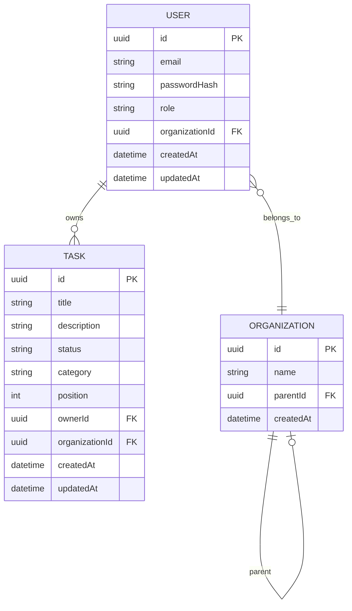

# Secure Task Management System

A full-stack task management application with role-based access control (RBAC), built with NestJS, Angular, and NX monorepo.

## Setup

### Prerequisites

- Node.js >= 18
- npm >= 9

### Installation

```bash
npm install
```

### Environment Variables

Create `.env` in the project root:

```env
# TODO: Add actual values
JWT_SECRET=your-secret-key
JWT_EXPIRES_IN=1d
DATABASE_TYPE=sqlite
DATABASE_NAME=taskdb.sqlite
```

### Run Applications

| App       | Command                  | URL                        |
|-----------|--------------------------|----------------------------|
| API       | `npx nx serve api`       | http://localhost:3000/api  |
| Dashboard | `npx nx serve dashboard` | http://localhost:4200      |

### Run Tests

```bash
npx nx test api
npx nx test dashboard
npx nx test data
npx nx test auth
```

---

## Architecture

### NX Monorepo Structure

```
├── api/          # NestJS backend
├── dashboard/    # Angular frontend
├── data/         # Shared DTOs & interfaces
├── auth/         # RBAC guards, decorators, policies
```

> **Note:** NX v22+ places projects at root level by default. This maps conceptually to the traditional `apps/` and `libs/` structure.

### Shared Libraries

| Library | Purpose |
|---------|---------|
| `data`  | TypeScript interfaces, DTOs, enums shared between frontend and backend |
| `auth`  | RBAC decorators, guards, and permission logic (backend-focused, but types shared) |

### Design Decisions

- SQLite is used for local development to keep setup friction low. The data layer is structured so switching to PostgreSQL in production is straightforward.
- RBAC logic lives in a shared `auth` library to keep authorization rules explicit and testable.
- The application favors simplicity over abstraction for this challenge; tradeoffs and extensions are noted in the Future Improvements section.

---

## Data Model

### ERD



<!-- Permissions are derived from role enums in code rather than a separate table -->

---

## RBAC Rules

| Role   | Create Task | Read Task         | Update Task       | Delete Task       | View Audit Log |
|--------|-------------|-------------------|-------------------|-------------------|----------------|
| Owner  | Yes         | All in org + subs | All in org + subs | All in org + subs | Yes            |
| Admin  | Yes         | All in own org    | All in own org    | All in own org    | Yes            |
| Viewer | No          | Read-only access to tasks in own organization | No                | No                | No             |

<!-- TODO: Confirm role inheritance and org hierarchy rules -->

---

## API Endpoints

| Method | Endpoint       | Description                  | Auth Required | Roles Allowed       |
|--------|----------------|------------------------------|---------------|---------------------|
| POST   | `/auth/login`  | Authenticate user            | No            | —                   |
| POST   | `/tasks`       | Create a new task            | Yes           | Owner, Admin        |
| GET    | `/tasks`       | List accessible tasks        | Yes           | Owner, Admin, Viewer|
| PUT    | `/tasks/:id`   | Update task                  | Yes           | Owner, Admin        |
| DELETE | `/tasks/:id`   | Delete task                  | Yes           | Owner, Admin        |
| GET    | `/audit-log`   | View access logs             | Yes           | Owner, Admin        |

<!-- TODO: Add sample request/response bodies -->

---

## Frontend Features

The frontend prioritizes clarity and correctness over visual polish for this challenge.

- [ ] Login page with JWT authentication
- [ ] Task dashboard with CRUD operations
- [ ] Sort, filter, and categorize tasks (Work, Personal, etc.)
- [ ] Drag-and-drop for reordering and status changes
- [ ] Responsive design (mobile to desktop)
- [ ] State management (TODO: choose solution)

### Bonus (Optional)

- [ ] Task completion visualization (bar chart)
- [ ] Dark/light mode toggle
- [ ] Keyboard shortcuts

---

## CI/CD

<!-- TODO: Add GitHub Actions workflow -->

```yaml
# .github/workflows/ci.yml
# TODO: Define lint, test, build steps
```

---

## Docker

<!-- TODO: Add Dockerfile and docker-compose.yml -->

```dockerfile
# TODO: Multi-stage build for API
# TODO: Nginx for Angular static files
```

---

## Future Improvements

- JWT refresh tokens
- CSRF protection
- RBAC permission caching for performance
- Advanced role delegation
- Rate limiting
- Pagination for tasks and audit logs
- WebSocket for real-time task updates
- Production database (PostgreSQL)

---

## License

<!-- TODO: Add license if needed -->
